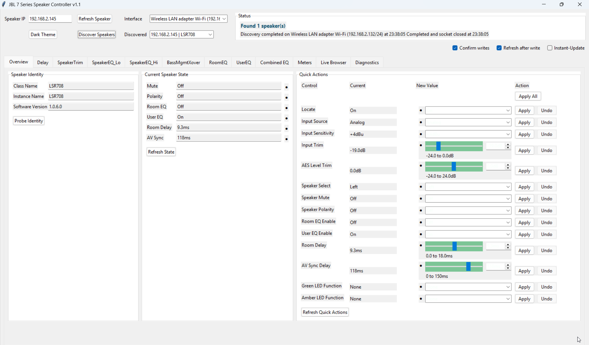
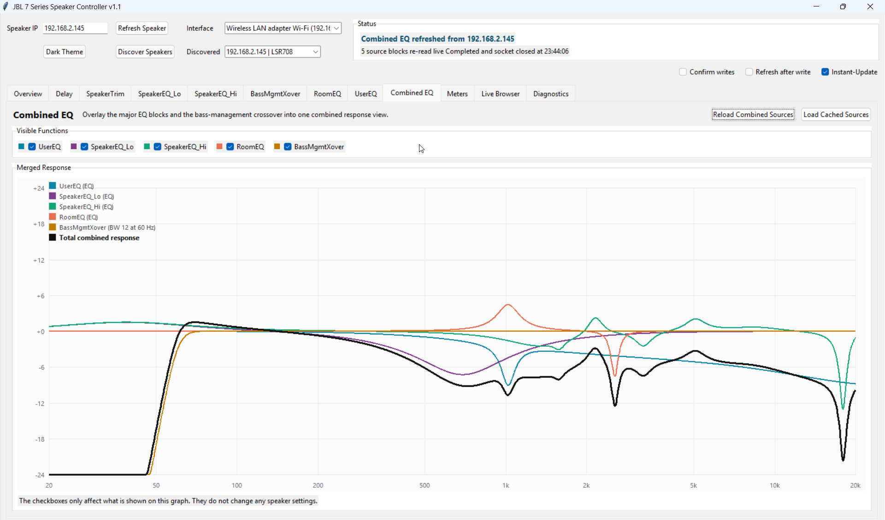
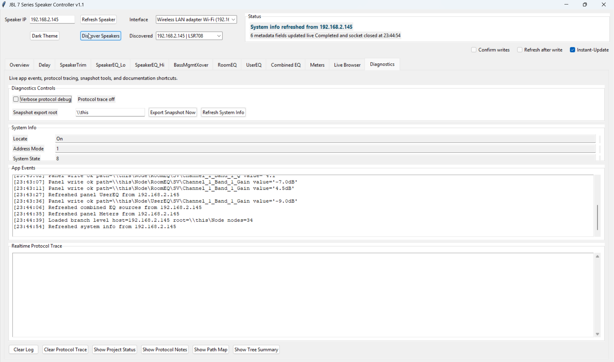

# JBL 7 Series Speaker Controller

A open source remote controller for JBL 7 Series powered speakers.

This project came about as reaction to "Wait, this speaker has a network port but I can't control it remotely?"

With this tool, not only can you control all the EQ, delay, trim, source and other controls remotely with the speaker in place, you can also see how the speaker was tuned in the factory. Being able to use all the DSP functions remotely increases the value, flexibility and functionality of all JBL 7 Series powered speakers.

Credit where credit is due. This app was built entirely via Codex, going from blank slate discovery to a working program in a few hours. It was further refined over a few evenings. AI is amazing.

## Download The Prebuilt Controller

If you just want to run the controller on Windows, download the compiled executable here:

- [Download the latest Windows release](https://github.com/QuietCal/jbl-7-series-remote-control/releases/latest/download/JBL7SpeakerController.exe)
- [Open the Releases page](https://github.com/QuietCal/jbl-7-series-remote-control/releases/latest)

No build step is required. Download the `.exe`, keep `lsr7_controller_config.json` next to it if you want the bundled default config, and run it.

## What This Project Is

- A desktop controller for JBL 7 Series powered speakers
- A speaker discovery and control tool built around a live WebSocket API connection
- A curated UI for the settings that are most useful in real use, organized in a logical fashion
- Supporting reference docs for protocol mapping and optional reverse-engineering

## Screenshots

The app includes focused tabs for discovery, quick actions, EQ editing, graph overlays, live tree browsing, and diagnostics.

### Overview



### Combined EQ



### Diagnostics



See the full screenshot gallery in [`docs/SCREENSHOTS.md`](docs/SCREENSHOTS.md).

## Current Status

- Current working version: `1.1`
- Open to feedback for improvements, changes or new features
- Available as both compiled version ready to run, or as source code
- Python launcher: [`run_lsr7_controller.py`](run_lsr7_controller.py)
- Built executable output: `dist/JBL7SpeakerController.exe`

## Quick Start

### Windows Download

1. Download [JBL7SpeakerController.exe](https://github.com/QuietCal/jbl-7-series-remote-control/releases/latest/download/JBL7SpeakerController.exe).
2. Download [lsr7_controller_config.json](https://github.com/QuietCal/jbl-7-series-remote-control/releases/latest/download/lsr7_controller_config.json) if you want the default config beside the executable.
3. Run `JBL7SpeakerController.exe`.

### Run From Source

Run from the project folder:

```powershell
python .\run_lsr7_controller.py
```

Compatibility launcher:

```powershell
python .\run_controller.py
```

`run_controller.py` only forwards into the main app.

## Build The Executable

From the project root:

```terminal
python.exe -m PyInstaller --noconfirm --clean --onefile --windowed --name JBL7SpeakerController run_lsr7_controller.py
```

Output:

- `dist/JBL7SpeakerController.exe`
- [`JBL7SpeakerController.spec`](JBL7SpeakerController.spec)

## Main Workflow

1. Enter or confirm the target speaker IP.
2. Choose the correct local network interface.
3. Use `Discover Speakers` if needed.
4. Open the tab you want to work in.
5. Refresh that view or enable `Instant-Update` for immediate single-control writes.

## Main UI

### Top Bar

- `Speaker IP`: current target speaker
- `Dark Theme` / `Light Theme`: switch app theme
- `Refresh Speaker`: refresh identity and overview state
- `Interface`: local NIC used for discovery
- `Discover Speakers`: scan the selected subnet for reachable LSR7 speakers
- `Discovered`: choose a discovered speaker and load its IP
- `Confirm writes`: require confirmation before writes
- `Refresh after write`: refresh the related view after a write
- `Instant-Update`: immediately apply changed values one control at a time
- `Status`: two-line operation summary with live refresh feedback

### Tabs

- `Overview`
  - speaker identity
  - current speaker state
  - quick actions
- `Delay`
  - room delay
  - AV sync delay
- `SpeakerTrim`
  - factory/service-oriented trim controls
- `SpeakerEQ_Lo`
  - factory-tuned low EQ
  - changes are temporary and revert after reboot
- `SpeakerEQ_Hi`
  - factory-tuned high EQ
  - changes are temporary and revert after reboot
- `BassMgmtXover`
  - bass management controls
  - response graph
- `RoomEQ`
  - room correction EQ
  - response graph
- `UserEQ`
  - user-adjustable EQ
  - response graph
- `Combined EQ`
  - overlays the main EQ blocks and bass-management crossover
- `Meters`
  - grouped input and output meter views
- `Live Browser`
  - branch-by-branch live path browser
- `Diagnostics`
  - app log
  - realtime protocol trace
  - snapshot export tools

## Editing Behavior

- Most constrained inputs use dropdowns, sliders, or bounded entry controls instead of free-form text.
- Front-end labels are normalized where helpful. Example: `Input Sensitivity` shows `+4dBu` and `-10dBV` while still writing `Plus4` / `Minus10` to the speaker.
- Dirty values turn orange.
- Successfully applied values turn blue.
- Freshly loaded values turn green.
- Row-level `Undo` is available on editable rows.
- Global undo/redo uses standard shortcuts:
  - `Ctrl+Z`
  - `Ctrl+Y`
  - `Ctrl+Shift+Z`

## Instant-Update Mode

`Instant-Update` is designed for fast tuning:

- writes only the control that changed
- does not trigger a full tab refresh
- turns off `Confirm writes` and `Refresh after write` while active
- restores those two options to their previous states when turned off
- flashes continuously while enabled

EQ graphs redraw immediately after successful writes that affect them.

## Input Rules

The UI now enforces the manual-backed constraints that are clear and safe to constrain.

Examples:

- `Input Trim`: `-24.0dB` to `0.0dB` in `0.1dB` steps
- `AES Level Trim`: `-24.0dB` to `+24.0dB` in `0.1dB` steps
- `Room Delay`: `0.0ms` to `18.0ms` in `0.1ms` steps
- `AV Sync Delay`: `0ms` to `150ms` in whole milliseconds
- `Bass Management Frequency`: `60 / 70 / 80 / 100 / 120 Hz`
- `EQ Gain`: `-12.0dB` to `+12.0dB`
- `EQ Q`: `0.1` to `12.0`
- `EQ Frequency`: bounded 1/24-octave choice list

Enable-style fields are normalized in the UI to `On` / `Off`, even when the speaker uses variations such as `Enable`, `Disable`, `Enabled`, or `Disabled`.

## Important Cautions

- `SpeakerEQ_Lo` and `SpeakerEQ_Hi` are factory-tuned sections.
- Their changes do not survive a reboot.
- Changing them is possible, but not recommended.
- `SpeakerTrim` is also closer to a factory/service function than a normal day-to-day user control.

## Discovery

The app can enumerate local IPv4 interfaces and probe the selected subnet for speakers that respond on the verified WebSocket control port.

Typical discovery flow:

1. Select the correct interface.
2. Click `Discover Speakers`.
3. Pick a discovered speaker from the dropdown.
4. Use `Refresh Speaker`.

## Live Browser

`Live Browser` is intentionally focused and conservative.

- It loads one branch level at a time.
- It supports drill-down and move-up navigation.
- It is useful for confirming paths without forcing a full live crawl.

## Crawl / Cache Tools

Optional reverse-engineering and cache-building notes now live in [`TURTLE_CRAWLER.md`](TURTLE_CRAWLER.md).

If you just need the command:

```powershell
powershell -ExecutionPolicy Bypass -File .\run_lsr7_turtle_crawl.ps1
```

## Key Files

- [`run_lsr7_controller.py`](run_lsr7_controller.py): main entry point
- [`lsr7_gui.py`](lsr7_gui.py): main desktop app
- [`lsr7_ws.py`](lsr7_ws.py): WebSocket client
- [`lsr7_catalog.py`](lsr7_catalog.py): tabs, control paths, input hints
- [`lsr7_network.py`](lsr7_network.py): discovery and NIC enumeration
- [`lsr7_storage.py`](lsr7_storage.py): config and cache helpers
- [`PROJECT_STATUS.md`](PROJECT_STATUS.md): concise handoff and repo orientation
- [`LSR7_WEBSOCKET_PROTOCOL.md`](LSR7_WEBSOCKET_PROTOCOL.md): protocol notes
- [`TURTLE_CRAWLER.md`](TURTLE_CRAWLER.md): crawler usage and reverse-engineering workflow
- [`VERSION.md`](VERSION.md): version milestones

## Additional Docs

- [`PROJECT_STATUS.md`](PROJECT_STATUS.md): where the project stands right now
- [`LSR7_WEBSOCKET_PROTOCOL.md`](LSR7_WEBSOCKET_PROTOCOL.md): confirmed protocol grammar and response shapes
- [`TURTLE_CRAWLER.md`](TURTLE_CRAWLER.md): turtle crawler usage, pacing, and resume behavior
- [`LSR7_MAPPED_PATHS.md`](LSR7_MAPPED_PATHS.md): mapped path reference
- [`LSR7_TREE_SUMMARY.md`](LSR7_TREE_SUMMARY.md): cache summary
- [`708P_INVESTIGATION_LOG.md`](708P_INVESTIGATION_LOG.md): older reverse-engineering notes

## Safety Notes

- The app writes directly to the speaker.
- Keep `Confirm writes` enabled unless you intentionally want fast iteration.
- Snapshot export is read-only.
- Be especially cautious in the factory-tuned sections.
