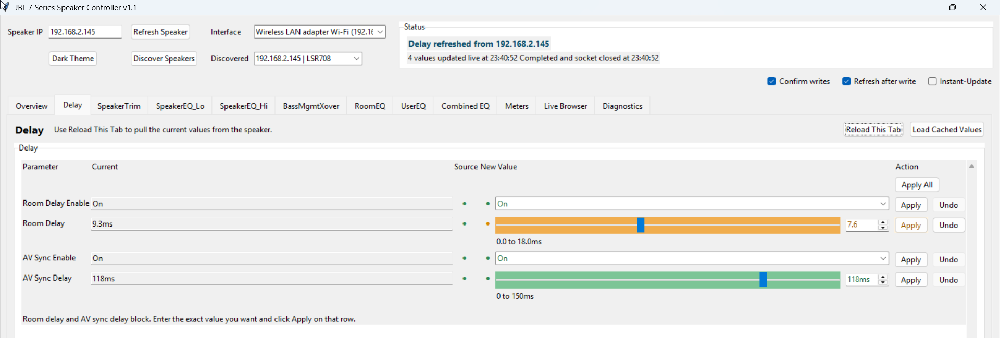
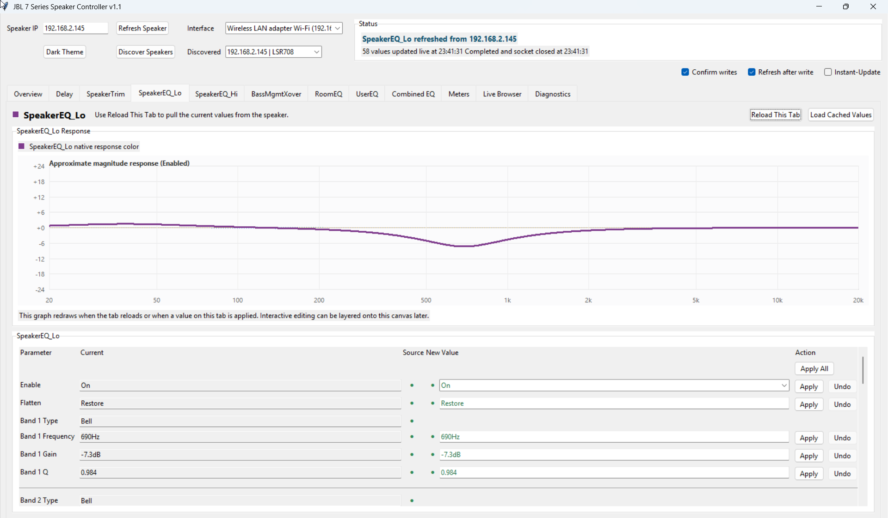
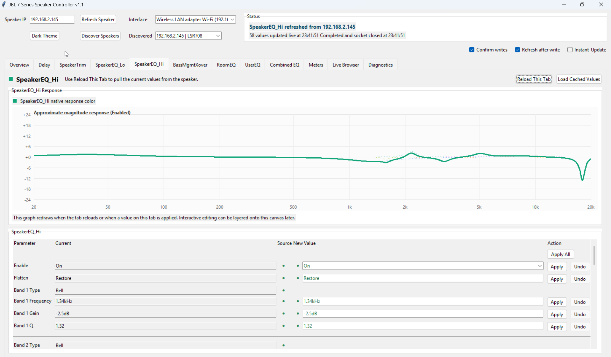
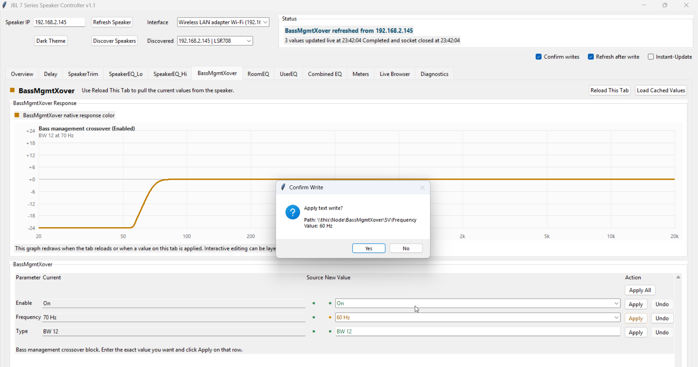
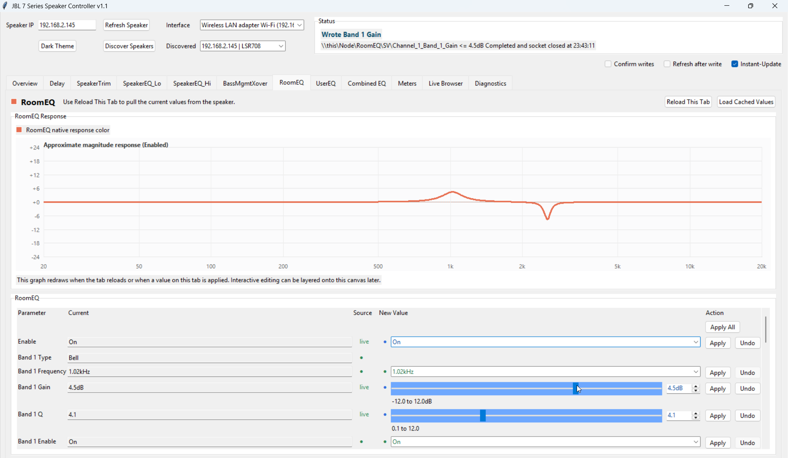
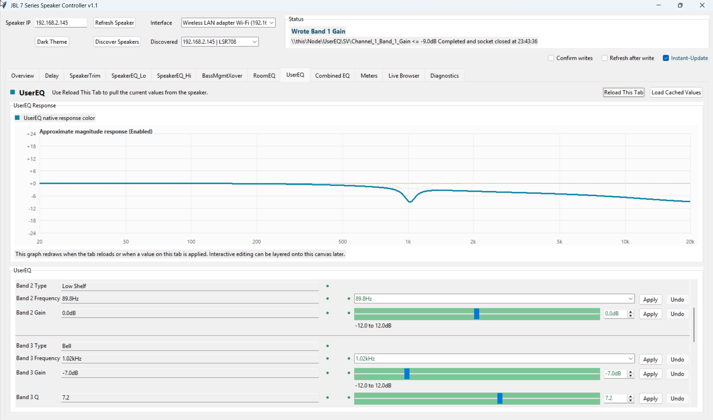
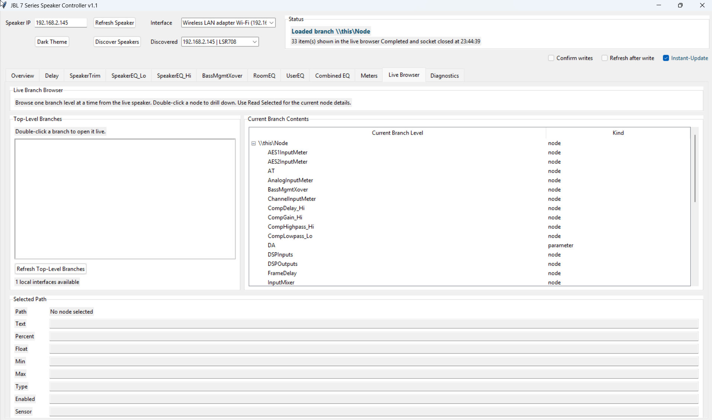

# Screenshots

These screenshots show the main workflows and views in the JBL 7 Series Speaker Controller.

## Overview

Shows speaker identity, current speaker state, and quick-access controls for common actions.

## Delay

Room delay and AV sync delay controls with bounded editing and row-level apply actions.

## SpeakerEQ Lo

Factory-tuned low EQ view with a live response graph and editable parameters.

## SpeakerEQ Hi

Factory-tuned high EQ view with a live response graph and editable parameters.

## Bass Management

Bass-management crossover view, including the confirm-write flow for parameter changes.

## RoomEQ

Room EQ editing with `Instant-Update` enabled for fast tuning.

## UserEQ

User-adjustable EQ controls with graph visualization and direct parameter editing.

## Combined EQ

Overlay of the major EQ blocks and crossover response in a single merged graph.

## Live Browser

Branch-by-branch live path browser for inspecting the speaker tree without forcing a full crawl.

## Diagnostics

Diagnostics tools for app events, protocol tracing, system info, and snapshot export.

